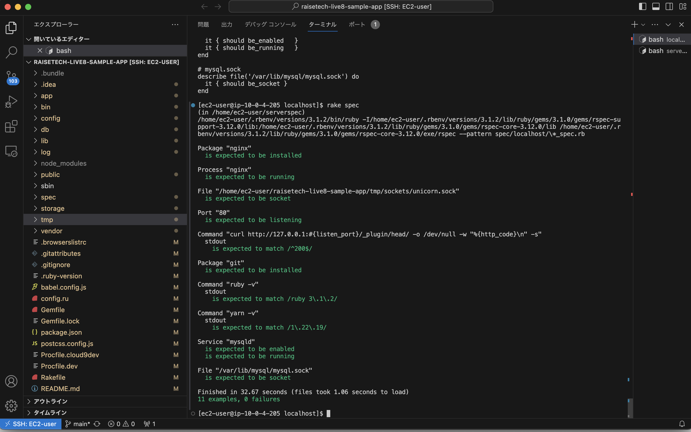

# AWS第11回講義課題

### ●ServerSpec のテストが成功すること。

SeverSpecを使って第5回で作成した環境をテストする

`gem install serverspec`：serverspecをインストール

`which serverspec-init`：serverspec-initコマンドが使えるようになっているのを確認

serverspecのディレクトリを作成して

`serverspec-init`：serverspecの設定ファイルを生成

`1) UN*X`を選択、`2) Exec (local)`を選択。

`serverspec/spec/localhost/sample_spec.rb`：このサンプルファイル内を修正する

`sample_spec.rb`↓※第5回の課題を振り返りながら必要なテスト項目を確認する

```ruby
require 'spec_helper'

# port
listen_port = 80

# nginx
describe package('nginx') do
  it { should be_installed }
end

# nginx process
describe process('nginx') do
  it { should be_running }
end

# unicorn.sock
describe file('/home/ec2-user/raisetech-live8-sample-app/tmp/sockets/unicorn.sock') do
  it { should be_socket }
end

# listen port
describe port(listen_port) do
  it { should be_listening }
end

# http
describe command('curl http://127.0.0.1:#{listen_port}/_plugin/head/ -o /dev/null -w "%{http_code}\n" -s') do
  its(:stdout) { should match /^200$/ }
end

# git
describe package('git') do
  it { should be_installed }
end

# ruby version
describe command('ruby -v') do
  its(:stdout) { should match /ruby 3\.1\.2/ }
end

# yarn version
describe command('yarn -v') do
  its(:stdout) { should match /1\.22\.19/ }
end

# mysql
describe service('mysqld') do
  it { should be_enabled   }
  it { should be_running   }
end

# mysql.sock
describe file('/var/lib/mysql/mysql.sock') do
  it { should be_socket }
end
```

`rake spec`：`sample_spec.rb`に記述されているテストを実行する



